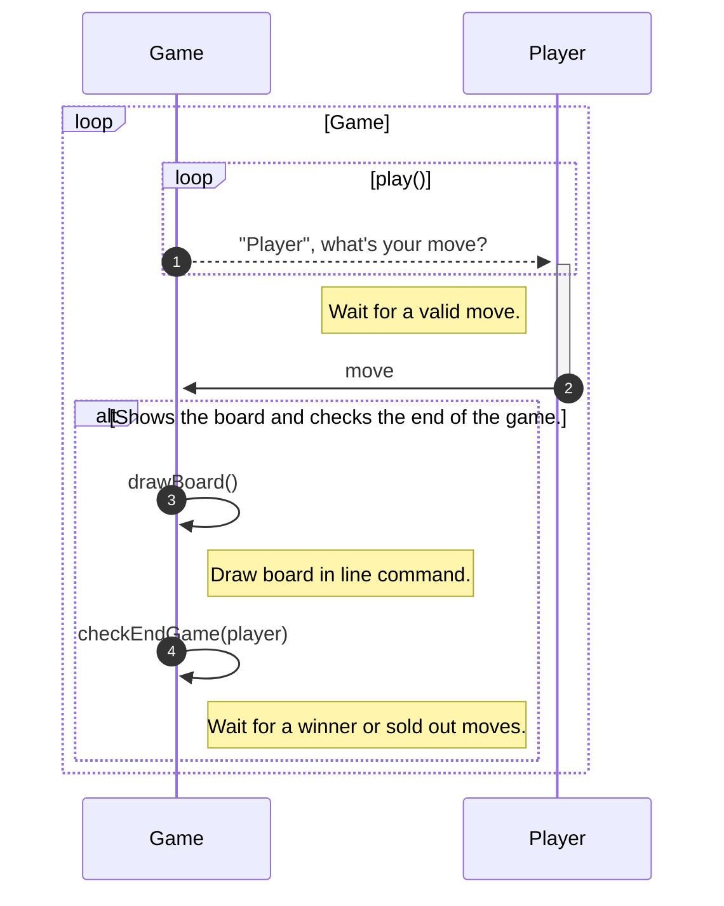

[](https://github.com/olbiwan/tic-tac-toe/releases/tag/073023)


[](https://github.com/olbiwan/tic-tac-toe/actions/workflows/build-java.yml)
[](https://github.com/olbiwan/tic-tac-toe/actions/workflows/build-kotlin.yml)
[](https://github.com/olbiwan/tic-tac-toe/actions/workflows/build-nodejs.yml)
[](https://github.com/olbiwan/tic-tac-toe/actions/workflows/build-python.yml)

# [Tic-tac-toe](https://en.wikipedia.org/wiki/Tic-tac-toe)

_It is the classic game of **Tic-tac-toe** built on the **command line**, represented in **several programming languages**. **The challenge is to build the most optimizeable code possible in a single class.**_

```bash
Player 'X' it's your turn, enter your position (row): 1
Player 'X' it's your turn, enter your position (column): 1
 X |   |
   |   |
   |   |
Player 'O' it's your turn, enter your position (row): 2
Player 'O' it's your turn, enter your position (column): 2
 X |   |
   | O |
   |   |
Player 'X' it's your turn, enter your position (row): 1
Player 'X' it's your turn, enter your position (column): 2
 X | X |
   | O |
   |   |
Player 'O' it's your turn, enter your position (row): 3
Player 'O' it's your turn, enter your position (column): 3
 X | X |
   | O |
   |   | O
Player 'X' it's your turn, enter your position (row): 1
Player 'X' it's your turn, enter your position (column): 3
 X | X | X
   | O |
   |   | O
Player X won!!!
```

## ⚡️Run the project
Below are instructions for running the project in different programming languages.  

<details open><summary><b>Build and run <a href="https://en.wikipedia.org/wiki/Tic-tac-toe">Tic-tac-toe</a> in <a href="https://en.wikipedia.org/wiki/Java_(programming_language)">Java</a>/<a href="https://en.wikipedia.org/wiki/Kotlin_(programming_language)">Kotlin</a>:</b><br><br></summary>
 
1. **Install [JDK 17](https://www.oracle.com/java/technologies/downloads)**.  
   _To validate the installation, open the command line and type: `java --version`._
2. **Configure Maven** [(if you need help click here)](https://maven.apache.org/install.html).  
  _To validate the configuration, open the command line and type: `mvn --v`._
3. **Package the project** by opening the command line and typing `mvn install` inside folder `tic-tac-toe/java` or `tic-tac-toe/kotlin`.  
   _To validate check if the `target` folder was created with the file `tictactoe.jar` inside._
6. _Finally_ **run the [Tic-tac-toe](https://en.wikipedia.org/wiki/Tic-tac-toe)**, open the command line and type `java -jar target/tictactoe.jar`.

</details>

<details open><summary><b>Build and run <a href="https://en.wikipedia.org/wiki/Tic-tac-toe">Tic-tac-toe</a> in <a href="https://en.wikipedia.org/wiki/Node.js">Node.js</a>:</b><br><br></summary>

1. **Install [Node.js 20.11.1](https://nodejs.org/en)**.  
   _To validate the installation, open the command line and type: `node -v`._
3. **Download external dependencies** by opening the command line and typing `npm install` inside folder `tic-tac-toe/nodejs`.  
   _To validate, check if the `node_modules` folder was created._
6. _Finally_ **run the [Tic-tac-toe](https://en.wikipedia.org/wiki/Tic-tac-toe)**, open the command line and type `npm start`.

</details>

<details open><summary><b>Build and run <a href="https://en.wikipedia.org/wiki/Tic-tac-toe">Tic-tac-toe</a> in <a href="https://en.wikipedia.org/wiki/Python_(programming_language)">Python</a>:</b><br><br></summary>

1. **Install [Python 3.8.5](https://www.python.org/downloads)**.  
   _To validate the installation, open the command line and type: `py --version`._
2. **Install pip** [(if you need help click here)](https://pip.pypa.io/en/stable/installation).  
  _To validate the configuration, open the command line and type: `pip --version`._
4. **Download external dependencies** by opening the command line and typing `pip install pytest python-utils` inside folder `tic-tac-toe/python`.  
   _To validate, open the command line and type: `pip show pytest` and `pip show python-utils`._
6. _Finally_ **run the [Tic-tac-toe](https://en.wikipedia.org/wiki/Tic-tac-toe)**, open the command line and type `py tictactoe/tictactoe_python.py`.

</details>

## 👨‍🎓 A little about the architecture


```mermaid
sequenceDiagram
    autonumber
    loop Game
        activate Player
          loop play()
              Game-->>+Player: "Player", what's your move?
          end
          Note left of Player: Wait for a valid move.
          Player->>+Game: move
        deactivate Player
        alt Shows the board and checks the end of the game.
          Game->>Game: drawBoard()
          Note right of Game: Draw board in line command.
          Game->>Game: checkEndGame(player)
          Note right of Game: Wait for a winner or sold out moves.
        end
    end
```

<details open><summary><b><a href="https://en.wikipedia.org/wiki/Java_(programming_language)">Java</a></b><br><br></summary>


[](https://sonarcloud.io/component_measures?metric=cognitive_complexity&id=tictactoe-java)
[](https://sonarcloud.io/component_measures?metric=complexity&id=tictactoe-java)
[](https://sonarcloud.io/summary/new_code?id=tictactoe-java)
[](https://sonarcloud.io/summary/new_code?id=tictactoe-java)

**Dependencies:**
1. _Dependency - [**Apache Commons Lang**](https://commons.apache.org/proper/commons-lang): Utility library._
3. _Dependency - [**JUnit 5**](https://junit.org/junit5): Unit testing framework._
4. _Dependency - [**Mockito**](https://site.mockito.org): Unit testing framework._
5. _Dependency - [**Project Lombok**](https://projectlombok.org): Library that automatically connects to your editor and creates tools to "spice up" Java._

</details>

<details open><summary><b><a href="https://en.wikipedia.org/wiki/Kotlin_(programming_language)">Kotlin</a></b><br><br></summary>


[](https://sonarcloud.io/component_measures?metric=cognitive_complexity&id=tictactoe-kotlin)
[](https://sonarcloud.io/component_measures?metric=complexity&id=tictactoe-kotlin)
[](https://sonarcloud.io/summary/new_code?id=tictactoe-kotlin)
[](https://sonarcloud.io/summary/new_code?id=tictactoe-kotlin)

**Dependencies:**
1. _Dependency - [**Apache Commons Lang**](https://commons.apache.org/proper/commons-lang): Utility library._
3. _Dependency - [**JUnit 5**](https://junit.org/junit5): Unit testing framework._
4. _Dependency - [**Mockito**](https://site.mockito.org): Unit testing framework._

</details>

<details open><summary><b><a href="https://en.wikipedia.org/wiki/Node.js">Node.js</a></b><br><br></summary>


[](https://sonarcloud.io/component_measures?metric=cognitive_complexity&id=tictactoe-python)
[](https://sonarcloud.io/component_measures?metric=complexity&id=tictactoe-python)
[](https://sonarcloud.io/summary/new_code?id=tictactoe-python)
[](https://sonarcloud.io/summary/new_code?id=tictactoe-python)  

**Dependencies:**
1. _Dependency - [**Jest**](https://jestjs.io): Unit testing framework._

</details>

<details open><summary><b><a href="https://en.wikipedia.org/wiki/Python_(programming_language)">Python</a></b><br><br></summary>

[](https://sonarcloud.io/component_measures?metric=cognitive_complexity&id=tictactoe-python)
[](https://sonarcloud.io/component_measures?metric=complexity&id=tictactoe-python)
[](https://sonarcloud.io/summary/new_code?id=tictactoe-python)
[](https://sonarcloud.io/summary/new_code?id=tictactoe-python)  

**Dependencies:**
1. _Dependency - [**pytest**](https://docs.pytest.org): Unit testing framework._
2. _Dependency - [**python-utils**](https://pypi.org/project/python-utils): Utility library._

</details>

---

_Follow new version by **[releases](https://github.com/olbiwan/Tic-tac-toe/releases)**._